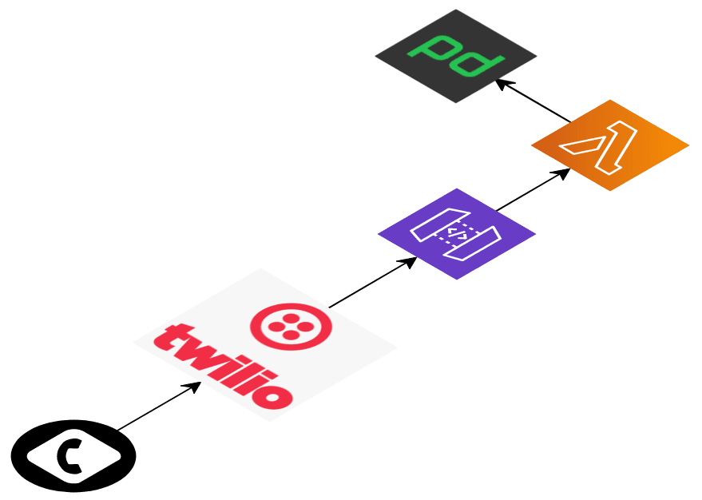

# sls-oncall-twilio

Serverless bot that fetches user oncall given a schedule in PagerDuty and
directs incoming call via Twilio.



This version of the app was made in conjuntion with the Schibsted engineering article
[Adding calls to your oncall rotation](https://medium.com/schibsted-engineering/).

## Deployment

Make sure you have your credentials configured for the AWS CLI.

Before the first ever deploy in a environment, PagerDuty and Twilio token need
to be stored in AWS Parameter Store under AWS Systems Manager.

```bash
$ aws ssm put-parameter --region=eu-west-1 --name "/sls-oncall-twilio/pd-token" --type "SecureString" --value "<YOUR PD TOKEN>"
$ aws ssm put-parameter --region=eu-west-1 --name "/sls-oncall-twilio/twilio-token" --type "SecureString" --value "<YOUR TWILIO TOKEN>"
```

Deploy with

```bash
$ npx sls deploy --stage pro
```

## Setup

Create Twilio account and set URL from deployment, combined with PagerDuty
schedule id as webhook address for the phone number.

## Security
https://www.twilio.com/docs/usage/security#validating-requests
